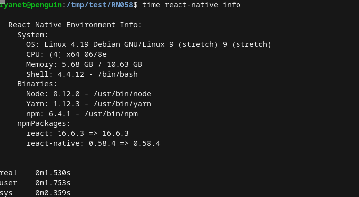
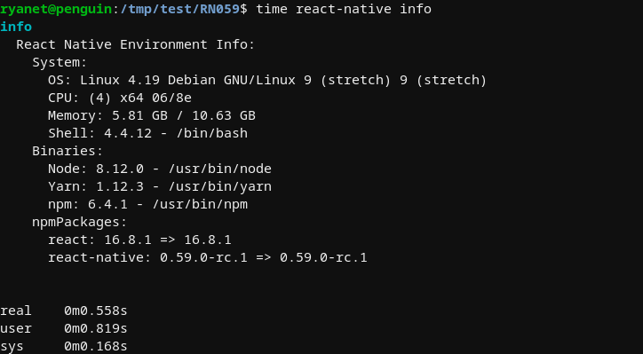

# 0.59

Welcome to the February 2019 release of React Native! This is another big release with 644 commits by 88 contributors. Contributions also come in other forms, so *thank you* for maintaining issues, fostering communities, and teaching people about React Native. This month brings a number of highly anticipated changes, and we hope you enjoy them.

## Hooks are here

[React Hooks](https://reactjs.org/docs/hooks-intro.html) are here, which powers functional reuse across components. This addition has a lot of buzz about it; take a look at some of the wonderful resources below to learn more:

> - [Introducing Hooks](https://reactjs.org/docs/hooks-intro.html) explains why we’re adding Hooks to React.
> - [Hooks at a Glance](https://reactjs.org/docs/hooks-overview.html) is a fast-paced overview of the built-in Hooks.
> - [Building Your Own Hooks](https://reactjs.org/docs/hooks-custom.html) demonstrates code reuse with custom Hooks.
> - [Making Sense of React Hooks](https://medium.com/@dan_abramov/making-sense-of-react-hooks-fdbde8803889) explores the new possibilities unlocked by Hooks.
> - [useHooks.com](https://usehooks.com/) showcases community-maintained Hooks recipes and demos.

Be sure to give this a try in your apps. We hope that you find the reuse as exciting as we do.

## Big Performance Gains and 64-bit Support on Android

The Android platform on React Native has an embedded WebKit JavaScript engine that powers most of your application (it's called the "JavaScript Core" or "JSC"). The JSC was quite out of date, which meant that a lot of modern JavaScript features weren't supported. Even worse, it performed poorly compared iOS's modern JSC. With this release, that all changes.

Thanks to some awesome work by [@DanielZlotin](https://twitter.com/danielzlotin), the JSC has caught up with the past few years. This brings with it 64-bit support, modern JavaScript support, and [big performance improvements](https://github.com/react-native-community/jsc-android-buildscripts/tree/master/measure). Kudos to Daniel for also making this a maintainable process now so that we can take advantage of future WebKit improvements without so much legwork.

## Faster app launches with inline requires

We want to help people have performant React Native apps by default and are working to bring Facebook's optimizations to the community. [@eli_white](https://twitter.com/eli_white) did incredible work to help applications load resources as needed rather than slowing down launch. This feature is called "inline requires", as it lets the packager identify components to be lazy loaded. Apps with a deep and varied component architecture will see the most improvement.

We need the community to let us know how it works before we turn it on by default. When you upgrade to 0.59, there will be a new `metro.config.js` file; flip the `inlineRequires` option and give us [your feedback](https://twitter.com/hashtag/inline-requires)! Read more about inline requires [in the performance docs](https://facebook.github.io/react-native/docs/0.56/performance#inline-requires) to learn how to see it works and benchmark your app before/after.

## Lean core is underway

React Native is a large and complex project with a complicated repository. This makes the codebase less approachable to contributors, difficult to test, and bloated as a dev dependency. [Lean Core](https://github.com/react-native-community/discussions-and-proposals/issues/6) is our effort to address these issues by migrating code to separate libraries for better management. The past few releases have seen the first steps of this, but [let's get serious](https://www.youtube.com/watch?v=FMLKb4or8yg).

You may notice that **AsyncStorage**, **ImageStore**, **MaskedViewIOS**, **NetInfo**, **Slider**, **Switch**, and **ViewPagerAndroid** are now officially deprecated. This is great news, as there are now owners for these features actively maintaining them. Heed the warning messages and migrate to the new libraries for these features, because in 0.60 they will be removed.

Over the coming months, there will be many more components following this path to a leaner core. We're looking for help with this &mdash; head over to the [lean core umbrella](https://github.com/facebook/react-native/issues/23313) to pitch in.

## CLI improvements

React Native's command like tools are developer's entrypoint to the ecosystem, but they had long-standing issues and lacked official support. The CLI tools have been moved to a separate repository, and a dedicated group of maintainers have already made some exciting improvements.

Logs are formatted much better now. Commands now run nearly instantly &mdash; you'll immediately notice a difference:

Some long-standing issues have been fixed too. Thanks to the [dedicated group of maintainers](https://blog.callstack.io/the-react-native-cli-has-a-new-home-79b63838f0e6) working in a [new repository](https://github.com/react-native-community/react-native-cli). This work was proposed in [RFC0003](https://github.com/react-native-community/discussions-and-proposals/blob/master/proposals/0003-Extracted-Command-Line-Tools.md), and we're excited to see it completed.

## Changelog

Without further adieu, the changes are below.

### Added

- Add Network Security Config file (fixes #22375) (#23105) ([3b0b7ce](https://github.com/facebook/react-native/commit/3b0b7ce) by [@Salakar](https://github.com/Salakar))
- Add image bytes property of UIImage (#22731) ([103880b](https://github.com/facebook/react-native/commit/103880b) by [@zhongwuzw](https://github.com/zhongwuzw))
- Add ImageIO related C nullable check to prevent crash (#23186) ([d0cd3ca](https://github.com/facebook/react-native/commit/d0cd3ca) by [@zhongwuzw](https://github.com/zhongwuzw))
- Add rejectResponderTermination prop to TextInput (#16755) ([11df0ea](https://github.com/facebook/react-native/commit/11df0ea) by [@cmcewen](https://github.com/cmcewen))
- Add QPL marker to track time it takes to load .so file from RN ([10b5218](https://github.com/facebook/react-native/commit/10b5218) by [@mdvacca](https://github.com/mdvacca))
- Add `YGMarkerLayout` ([1db5580](https://github.com/facebook/react-native/commit/1db5580) by [@davidaurelio](https://github.com/davidaurelio))
- Add function to set marker callbacks ([43601f1](https://github.com/facebook/react-native/commit/43601f1) by [@davidaurelio](https://github.com/davidaurelio))
- Add `MarkerSection` ([f1a3137](https://github.com/facebook/react-native/commit/f1a3137) by [@davidaurelio](https://github.com/davidaurelio))
- Adds fixes for react-native-windows UWP (#848) ([dfcbf97](https://github.com/facebook/react-native/commit/dfcbf97) by [@rozele](https://github.com/rozele))
- Add QPL marker to track time it takes to load .so file from RN ([8110909](https://github.com/facebook/react-native/commit/8110909) by [@mdvacca](https://github.com/mdvacca))
- Add performance counters for Fabric ([7f27888](https://github.com/facebook/react-native/commit/7f27888) by [@mdvacca](https://github.com/mdvacca))
- Add support for intent:// URIs ([52bdf34](https://github.com/facebook/react-native/commit/52bdf34))
- Add jest test to ensure consistency between AnimatedMock and AnimatedImplementation ([8a5614b](https://github.com/facebook/react-native/commit/8a5614b) by [@PeteTheHeat](https://github.com/PeteTheHeat))
- add back buildToolsVersion to build.gradle (#23316) ([cf52ab5](https://github.com/facebook/react-native/commit/cf52ab5) by [@dulmandakh](https://github.com/dulmandakh))
- Add deprecation notice to ImageStore (#23330) ([62599fa](https://github.com/facebook/react-native/commit/62599fa) by [@EvanBacon](https://github.com/EvanBacon))
- add prettier check in ci (#23382) ([392e896](https://github.com/facebook/react-native/commit/392e896) by [@gengjiawen](https://github.com/gengjiawen))
- Add deprecation warning while importing Slider component (#23385) ([bf888a7](https://github.com/facebook/react-native/commit/bf888a7) by [@michalchudziak](https://github.com/michalchudziak))
- Add a deprecation warning when importing NetInfo (#23383) ([d9c0dfe](https://github.com/facebook/react-native/commit/d9c0dfe) by [@matt-oakes](https://github.com/matt-oakes))
- Add a Metro configuration with inline require/import ([ae11993](https://github.com/facebook/react-native/commit/ae11993) by [@cpojer](https://github.com/cpojer))
- Add more init perf markers ([864a301](https://github.com/facebook/react-native/commit/864a301) by [@sahrens](https://github.com/sahrens))
- Add Platform module for web target (#23387) ([daa79b0](https://github.com/facebook/react-native/commit/daa79b0) by [@EvanBacon](https://github.com/EvanBacon))

#### Android specific

- Android: Add a maxFontSizeMultiplier prop to <Text> and <TextInput> (#23069) ([4936d28](https://github.com/facebook/react-native/commit/4936d28) by [@rigdern](https://github.com/rigdern))
- Android: Add error description to Image onError callback (#22737) ([7795a67](https://github.com/facebook/react-native/commit/7795a67) by [@Jyrno42](https://github.com/Jyrno42))
- Added: informational error message on getting Android drawable folder… (#17751) ([a159a33](https://github.com/facebook/react-native/commit/a159a33) by [@BrunoVillanova](https://github.com/BrunoVillanova))
- Add ability to control scroll animation duration for Android (#22884) ([7e8b810](https://github.com/facebook/react-native/commit/7e8b810) by [@osdnk](https://github.com/osdnk))
- Revert D13860038: [react-native][PR] Add ability to control scroll animation duration for Android ([4c69ccd](https://github.com/facebook/react-native/commit/4c69ccd) by [@fkgozali](https://github.com/fkgozali))
- Add deprecation warning for ViewPagerAndroid (#23395) ([77300ca](https://github.com/facebook/react-native/commit/77300ca) by [@ferrannp](https://github.com/ferrannp))

#### iOS specific

- Fabric: Add Fabric-compatible Slider component to iOS ([c40a782](https://github.com/facebook/react-native/commit/c40a782) by [@JoshuaGross](https://github.com/JoshuaGross))
- Fabric: Add Fabric-compatible Slider component to iOS (ObjC code) ([62395d0](https://github.com/facebook/react-native/commit/62395d0) by [@JoshuaGross](https://github.com/JoshuaGross))
- Add types to RCTSnapshotNativeComponent (#23111) ([67ad72f](https://github.com/facebook/react-native/commit/67ad72f) by [@Naturalclar](https://github.com/Naturalclar))
- Add CF_RETURNS_NOT_RETAINED annotate for Objective-C method which returns Core Foundation object (#23122) ([9672c2e](https://github.com/facebook/react-native/commit/9672c2e) by [@zhongwuzw](https://github.com/zhongwuzw))
- TM iOS: added helper to check whether a class is TurboModule compatible ([d9f34bd](https://github.com/facebook/react-native/commit/d9f34bd) by [@fkgozali](https://github.com/fkgozali))
- Add deprecation warning for MaskedViewIOS (#23398) ([4ac65f5](https://github.com/facebook/react-native/commit/4ac65f5) by [@FonDorn](https://github.com/FonDorn))

### Changed

- Small changes to get Profile build working ([6418e30](https://github.com/facebook/react-native/commit/6418e30) by [@JoshuaGross](https://github.com/JoshuaGross))
- Various minor changes to allow compliation with msvc (#22182) ([8beb4bb](https://github.com/facebook/react-native/commit/8beb4bb))

#### Android specific

#### iOS specific

### Deprecated

- Replace deprecated `stringByReplacingPercentEscapesUsingEncoding:` with `stringByAddingPercentEncodingWithAllowedCharacters:` (#19792) ([61ca119](https://github.com/facebook/react-native/commit/61ca119) by [@pvinis](https://github.com/pvinis))

#### Android specific

#### iOS specific

### Removed

- Remove replaceOkHttpClient method (#16972) ([7cbdd7b](https://github.com/facebook/react-native/commit/7cbdd7b) by [@cdlewis](https://github.com/cdlewis))
- Remove UIProp class from redex and proguard rules, it doesn't exist ([cf0c37b](https://github.com/facebook/react-native/commit/cf0c37b) by [@dulinriley](https://github.com/dulinriley))
- Remove components out of Bindings ([2b35659](https://github.com/facebook/react-native/commit/2b35659) by [@mdvacca](https://github.com/mdvacca))
- Remove ReactInstanceManager out of FabricJSIModuleProvider ([0bf6a8e](https://github.com/facebook/react-native/commit/0bf6a8e) by [@mdvacca](https://github.com/mdvacca))
- Remove unused constexpr ([52d9f26](https://github.com/facebook/react-native/commit/52d9f26) by [@davidaurelio](https://github.com/davidaurelio))
- Remove height styling when keyboard closed (#16965) ([745484c](https://github.com/facebook/react-native/commit/745484c) by [@shauns](https://github.com/shauns))
- Remove TabBarExample from Screenshot Tests (#23206) ([47a5bcb](https://github.com/facebook/react-native/commit/47a5bcb) by [@hramos](https://github.com/hramos))
- Temporary remove systraces from Fabric core code ([842b9c1](https://github.com/facebook/react-native/commit/842b9c1) by [@mdvacca](https://github.com/mdvacca))
- Remove jest and jest-junit from runtime dependencies (#23276) ([c7b57f1](https://github.com/facebook/react-native/commit/c7b57f1) by [@vovkasm](https://github.com/vovkasm))
- Remove assertion on TurboModule existence ([aa39cb6](https://github.com/facebook/react-native/commit/aa39cb6) by [@RSNara](https://github.com/RSNara))
- remove ViewHelper, use ViewCompat instead (#23280) ([c493cfe](https://github.com/facebook/react-native/commit/c493cfe) by [@dulmandakh](https://github.com/dulmandakh))
- JSBigString.h: Remove duplicate include of 'unistd.h' (#23297) ([cae6bef](https://github.com/facebook/react-native/commit/cae6bef) by [@empyrical](https://github.com/empyrical))
- Remove AnimatedImplementation spread from AnimatedMock ([7f646a5](https://github.com/facebook/react-native/commit/7f646a5) by [@PeteTheHeat](https://github.com/PeteTheHeat))
- remove redundant targetApi and version checks (#23302) ([a4840e7](https://github.com/facebook/react-native/commit/a4840e7) by [@dulmandakh](https://github.com/dulmandakh))
- Remove unused code in ReactTextView ([48ba440](https://github.com/facebook/react-native/commit/48ba440) by [@mdvacca](https://github.com/mdvacca))

#### Android specific

- remove unnecessary Android version checks (#23277) ([4d95e85](https://github.com/facebook/react-native/commit/4d95e85) by [@dulmandakh](https://github.com/dulmandakh))

#### iOS specific

- Remove AlertExample from RNTester in iOS (#23099) ([803480a](https://github.com/facebook/react-native/commit/803480a) by [@zhongwuzw](https://github.com/zhongwuzw))
- Remove TabbarIOS from OSS ([0269729](https://github.com/facebook/react-native/commit/0269729) by [@axe-fb](https://github.com/axe-fb))

### Fixed

- Fix SwipeableActionButton styling. (#23113) ([ad52f52](https://github.com/facebook/react-native/commit/ad52f52) by [@varungupta85](https://github.com/varungupta85))
- Fixed string ref which was causing alert on react <Strictmode> (#23146) ([e4d7fc0](https://github.com/facebook/react-native/commit/e4d7fc0) by [@rsmelo92](https://github.com/rsmelo92))
- fix: change template to work with jest (#23150) ([5218932](https://github.com/facebook/react-native/commit/5218932) by [@Esemesek](https://github.com/Esemesek))
- Fix small typo in comments of reactDecodedImageBytes (#23165) ([dd8f5de](https://github.com/facebook/react-native/commit/dd8f5de) by [@zhongwuzw](https://github.com/zhongwuzw))
- Fix issue #21065 getInspectorDataForViewTag is not a function (#21237) ([46f3285](https://github.com/facebook/react-native/commit/46f3285) by [@TranLuongTuanAnh](https://github.com/TranLuongTuanAnh))
- Fix Detox tests after upgrading to latest CLI (#23191) ([9a93704](https://github.com/facebook/react-native/commit/9a93704) by [@grabbou](https://github.com/grabbou))
- Fix warnings in JSI (#23201) ([ac90c4f](https://github.com/facebook/react-native/commit/ac90c4f) by [@rafaellincoln](https://github.com/rafaellincoln))
- Fix portability issues to Linux, FreeBSD, and older libc++ ([36916ee](https://github.com/facebook/react-native/commit/36916ee) by [@matthargett](https://github.com/matthargett))
- Fixes alert view block first responder (#23240) ([e4364fa](https://github.com/facebook/react-native/commit/e4364fa) by [@zhongwuzw](https://github.com/zhongwuzw))
- apply Network Security Config file (fixes #22375) (part 2 of #23105) (#23135) ([84572c4](https://github.com/facebook/react-native/commit/84572c4) by [@Salakar](https://github.com/Salakar))
- Fix for Image displayName, currently displaying as <Component> in tests (#23287) ([4989123](https://github.com/facebook/react-native/commit/4989123) by [@linnett](https://github.com/linnett))
- Fix broken jsiexecutor search path. (#23274) ([2aa2401](https://github.com/facebook/react-native/commit/2aa2401) by [@amccarri](https://github.com/amccarri))
- Fix duplicate symbols linker error in xcodeproj (#23284) ([9f72e6a](https://github.com/facebook/react-native/commit/9f72e6a) by [@tyrone-sudeium](https://github.com/tyrone-sudeium))
- Fix typo of startSurface comments (#23264) ([cca1cdf](https://github.com/facebook/react-native/commit/cca1cdf) by [@zhongwuzw](https://github.com/zhongwuzw))
- Fix regression of VirtualizedList jumpy header (#22025) ([e4fd9ba](https://github.com/facebook/react-native/commit/e4fd9ba) by [@danilobuerger](https://github.com/danilobuerger))
- Apply the fix for CJK languages on single-line text fields. (#22546) ([05ebf77](https://github.com/facebook/react-native/commit/05ebf77) by [@mandrigin](https://github.com/mandrigin))
- Fix flow typing of Text ([10c8352](https://github.com/facebook/react-native/commit/10c8352) by [@sahrens](https://github.com/sahrens))
- Fixes capitalized I's when emojiis are present after the text being edited. (#21951) ([f307ac7](https://github.com/facebook/react-native/commit/f307ac7) by [@dchersey](https://github.com/dchersey))
- fix lint error/warnings (#23333) ([d2fc19f](https://github.com/facebook/react-native/commit/d2fc19f) by [@dulmandakh](https://github.com/dulmandakh))
- fix WritableArray, WritableMap nullable annotations (#23397) ([7b33d6b](https://github.com/facebook/react-native/commit/7b33d6b) by [@dulmandakh](https://github.com/dulmandakh))
- Fix React Native calling private CLI APIs ([1f09967](https://github.com/facebook/react-native/commit/1f09967) by [@grabbou](https://github.com/grabbou))
- Fix React Native calling CLI wo location ([d37ffc3](https://github.com/facebook/react-native/commit/d37ffc3) by [@grabbou](https://github.com/grabbou))
- fix: bring local-cli back ([4cb1646](https://github.com/facebook/react-native/commit/4cb1646) by [@grabbou](https://github.com/grabbou))
- Fix id command ([ad279ee](https://github.com/facebook/react-native/commit/ad279ee) by [@hramos](https://github.com/hramos))

#### Android specific

- Fix textTransform when used with other text styles on Android (#22670) ([3a33e75](https://github.com/facebook/react-native/commit/3a33e75) by [@janicduplessis](https://github.com/janicduplessis))
- Fix Native Rotation Android (#18872) ([e405e84](https://github.com/facebook/react-native/commit/e405e84) by [@scisci](https://github.com/scisci))
- Fix Inverted Horizontal ScrollView on Android (#23233) ([32cb9ec](https://github.com/facebook/react-native/commit/32cb9ec) by [@dmainas](https://github.com/dmainas))
- fix checkbox casting crash in old android versions (#23281) ([58437cd](https://github.com/facebook/react-native/commit/58437cd) by [@vonovak](https://github.com/vonovak))
- Fix Android Gradle build ([7f5e044](https://github.com/facebook/react-native/commit/7f5e044) by [@grabbou](https://github.com/grabbou))

#### iOS specific

- Fix RCTImageLoader multi thread crash (#22746) ([5ed31ce](https://github.com/facebook/react-native/commit/5ed31ce))
- Fix SectionList layout of RNTester on iOS (#23119) ([25f7b0e](https://github.com/facebook/react-native/commit/25f7b0e) by [@zhongwuzw](https://github.com/zhongwuzw))
- Fix Warnings in Xcode (#23184) ([5a87093](https://github.com/facebook/react-native/commit/5a87093) by [@rafaellincoln](https://github.com/rafaellincoln))

### Security

#### Android specific

- improve Android Network Security config (#23429) ([724d83a](https://github.com/facebook/react-native/commit/724d83a) by [@dulmandakh](https://github.com/dulmandakh))

#### iOS specific

### Unknown

- Eager load Fabric classes ([b718d33](https://github.com/facebook/react-native/commit/b718d33) by [@mdvacca](https://github.com/mdvacca))
- Streamline templates (#23107) ([dda193a](https://github.com/facebook/react-native/commit/dda193a) by [@hramos](https://github.com/hramos))
- ActivityIndicator (#23104) ([5503355](https://github.com/facebook/react-native/commit/5503355) by [@VisibleMarkov](https://github.com/VisibleMarkov))
- Rename dev settings menu preferences file as it conflicts with fennec's (#23123) ([9968d0c](https://github.com/facebook/react-native/commit/9968d0c) by [@khaled-cliqz](https://github.com/khaled-cliqz))
- Friendlier Danger bot (#23124) ([9793b05](https://github.com/facebook/react-native/commit/9793b05) by [@cpojer](https://github.com/cpojer))
- migrate ci to official docker (#21477) ([9351dd6](https://github.com/facebook/react-native/commit/9351dd6) by [@gengjiawen](https://github.com/gengjiawen))
- Delete functionality for shared childen ([f4def00](https://github.com/facebook/react-native/commit/f4def00) by [@davidaurelio](https://github.com/davidaurelio))
- Feature/action sheet destructive button indexes (#18254) ([67e7f16](https://github.com/facebook/react-native/commit/67e7f16) by [@sdg9](https://github.com/sdg9))
- Globally disable LayoutAnimation during Snapshot Tests ([527fc9d](https://github.com/facebook/react-native/commit/527fc9d) by [@PeteTheHeat](https://github.com/PeteTheHeat))
- - update to gradle 4.10.1 or high (#23103) ([5be50d4](https://github.com/facebook/react-native/commit/5be50d4) by [@misaku](https://github.com/misaku))
- Fabric: Replace ImageLoader promise implementation with observer model ([b905548](https://github.com/facebook/react-native/commit/b905548) by [@JoshuaGross](https://github.com/JoshuaGross))
- Label issues that use the Bug Report template (#23162) ([af1f272](https://github.com/facebook/react-native/commit/af1f272) by [@hramos](https://github.com/hramos))
- Fabric: Use LRU to cache results of ParagraphShadowNode::measure ([a904944](https://github.com/facebook/react-native/commit/a904944) by [@JoshuaGross](https://github.com/JoshuaGross))
- Template Tweak ([03c16bd](https://github.com/facebook/react-native/commit/03c16bd) by [@hramos](https://github.com/hramos))
- Critical improvements for Map and Set polyfills. ([90850ca](https://github.com/facebook/react-native/commit/90850ca) by [@benjamn](https://github.com/benjamn))
- Separate MaskedViewExample into individual examples (#23168) ([b0302ec](https://github.com/facebook/react-native/commit/b0302ec) by [@CodingItWrong](https://github.com/CodingItWrong))
- Disable animation native driver in AnimatedGratuisousApp of RNTester (#23172) ([8508da4](https://github.com/facebook/react-native/commit/8508da4) by [@zhongwuzw](https://github.com/zhongwuzw))
- Fixing overscrolling issue on Virtualized List (#23181) ([4d5f85e](https://github.com/facebook/react-native/commit/4d5f85e))
- Disable no-inline-styles lint rule for RNTester (#23169) ([959a133](https://github.com/facebook/react-native/commit/959a133) by [@janicduplessis](https://github.com/janicduplessis))
- CameraRoll support for Videos and Photos showed in same time (#16429) ([54534e7](https://github.com/facebook/react-native/commit/54534e7) by [@kesha-antonov](https://github.com/kesha-antonov))
- Make the load-script-error less misleading (#17055) ([46aaa02](https://github.com/facebook/react-native/commit/46aaa02) by [@sunnylqm](https://github.com/sunnylqm))
- Update hash functions to use folly::hash::hash_combine ([88bc80c](https://github.com/facebook/react-native/commit/88bc80c) by [@JoshuaGross](https://github.com/JoshuaGross))
- Rename `YGMarkerType` to `YGMarker` ([e804124](https://github.com/facebook/react-native/commit/e804124) by [@davidaurelio](https://github.com/davidaurelio))
- SystemUiVisibility overwritten bug (#17370) ([8afa037](https://github.com/facebook/react-native/commit/8afa037) by [@rogerkerse](https://github.com/rogerkerse))
- Expose AsyncLocalStorage get/set methods (#18454) ([7b8235a](https://github.com/facebook/react-native/commit/7b8235a) by [@ejmartin504](https://github.com/ejmartin504))
- Always write the manifest in multiRemove (#18613) ([27b4d21](https://github.com/facebook/react-native/commit/27b4d21) by [@esprehn](https://github.com/esprehn))
- Introduce first marker ([c723029](https://github.com/facebook/react-native/commit/c723029) by [@davidaurelio](https://github.com/davidaurelio))
- Pass layout marker data along ([fc6a4b6](https://github.com/facebook/react-native/commit/fc6a4b6) by [@davidaurelio](https://github.com/davidaurelio))
- Layout marker metadata ([0dafa0d](https://github.com/facebook/react-native/commit/0dafa0d) by [@davidaurelio](https://github.com/davidaurelio))
- count cache hits ([f506019](https://github.com/facebook/react-native/commit/f506019) by [@davidaurelio](https://github.com/davidaurelio))
- Track how much measure cache entries are used ([c16fadb](https://github.com/facebook/react-native/commit/c16fadb) by [@davidaurelio](https://github.com/davidaurelio))
- Optimize pre-allocation of views ([16a6e51](https://github.com/facebook/react-native/commit/16a6e51) by [@mdvacca](https://github.com/mdvacca))
- Include PreAllocateViewMountItem into the eager initialization of Fabric classes ([6feb3dc](https://github.com/facebook/react-native/commit/6feb3dc) by [@mdvacca](https://github.com/mdvacca))
- Update Pull Request and Issue templates. (#23187) ([7bb7f01](https://github.com/facebook/react-native/commit/7bb7f01) by [@cpojer](https://github.com/cpojer))
- Location Services: don't reset desiredAccuracy on every update/error (#23209) ([bbcb97a](https://github.com/facebook/react-native/commit/bbcb97a) by [@omnikron](https://github.com/omnikron))
- Enhance image freshness check before stored into cache (#23226) ([e98d5a2](https://github.com/facebook/react-native/commit/e98d5a2) by [@zhongwuzw](https://github.com/zhongwuzw))
- Enable module lookup in TurboModules ([0ceefb4](https://github.com/facebook/react-native/commit/0ceefb4) by [@RSNara](https://github.com/RSNara))
- avoid double lookup of a nativemodule when resolving turbomodule ([1e6f534](https://github.com/facebook/react-native/commit/1e6f534) by [@fkgozali](https://github.com/fkgozali))
- Address some paragraph measure cache follow-up nits ([10e4a85](https://github.com/facebook/react-native/commit/10e4a85) by [@JoshuaGross](https://github.com/JoshuaGross))
- Adjust pull-bot configuration for new PR template (#23236) ([14e8c14](https://github.com/facebook/react-native/commit/14e8c14) by [@hramos](https://github.com/hramos))
- Marker for measure callbacks ([d2b2316](https://github.com/facebook/react-native/commit/d2b2316) by [@davidaurelio](https://github.com/davidaurelio))
- Marker for baseline callbacks ([e2bd70a](https://github.com/facebook/react-native/commit/e2bd70a) by [@davidaurelio](https://github.com/davidaurelio))
- bump soloader to 0.6.0 (#23239) ([07d1075](https://github.com/facebook/react-native/commit/07d1075) by [@dulmandakh](https://github.com/dulmandakh))
- Update xplat/js to 0.92.0 ([5ee7386](https://github.com/facebook/react-native/commit/5ee7386) by [@pakoito](https://github.com/pakoito))
- ReactActivity extends FragmentActivity (#22662) ([dda2b82](https://github.com/facebook/react-native/commit/dda2b82) by [@dulmandakh](https://github.com/dulmandakh))
- Expose isLocalUserInfoKey to keyboard event notifications (#23245) ([05f35c2](https://github.com/facebook/react-native/commit/05f35c2) by [@nossbigg](https://github.com/nossbigg))
- TM: trimming down module dependencies when getting NativeModules ([1bbb693](https://github.com/facebook/react-native/commit/1bbb693) by [@fkgozali](https://github.com/fkgozali))
- Use feature flags in Fabric C++ core, in particular for paragraph measurement caching ([28b8b8e](https://github.com/facebook/react-native/commit/28b8b8e) by [@JoshuaGross](https://github.com/JoshuaGross))
- Refine Keyboard API Event typings (#23272) ([7ee13cc](https://github.com/facebook/react-native/commit/7ee13cc) by [@nossbigg](https://github.com/nossbigg))
- Set wait_for_recheck=true to work around crash ([c599625](https://github.com/facebook/react-native/commit/c599625) by [@gabelevi](https://github.com/gabelevi))
- User-defined literals for `YGValue` ([5184f0d](https://github.com/facebook/react-native/commit/5184f0d) by [@davidaurelio](https://github.com/davidaurelio))
- Make `==` operator for `YGStyle` free function ([0e1d4ec](https://github.com/facebook/react-native/commit/0e1d4ec) by [@davidaurelio](https://github.com/davidaurelio))
- Only call __turboModuleProxy when it exists ([e1451ca](https://github.com/facebook/react-native/commit/e1451ca) by [@RSNara](https://github.com/RSNara))
- Start using getConstants ([f370933](https://github.com/facebook/react-native/commit/f370933) by [@RSNara](https://github.com/RSNara))
- Mock Animated for testing ([45686c8](https://github.com/facebook/react-native/commit/45686c8) by [@PeteTheHeat](https://github.com/PeteTheHeat))
- Introduce generic `warnOnce` function for warning messages (#22109) ([9a7fff9](https://github.com/facebook/react-native/commit/9a7fff9) by [@empyrical](https://github.com/empyrical))
- Enable Java8 (#23295) ([38eb2a7](https://github.com/facebook/react-native/commit/38eb2a7) by [@dulmandakh](https://github.com/dulmandakh))
- SuppressLint("MissingPermission") in Location, NetInfo, Vibration mod… (#23294) ([d53dbb0](https://github.com/facebook/react-native/commit/d53dbb0) by [@dulmandakh](https://github.com/dulmandakh))
- ReactActivity extends AppCompatActivity (#23278) ([3b9604f](https://github.com/facebook/react-native/commit/3b9604f) by [@dulmandakh](https://github.com/dulmandakh))
- Support image props for Slider component, feature parity with pre-Fabric Slider ([b6318ac](https://github.com/facebook/react-native/commit/b6318ac) by [@JoshuaGross](https://github.com/JoshuaGross))
- Enhance image freshness check before stored into cache (#23226) ([fb8ba3f](https://github.com/facebook/react-native/commit/fb8ba3f) by [@zhongwuzw](https://github.com/zhongwuzw))
- Move CoreModulesPackage to use TurboReactPackage ([aa3fc09](https://github.com/facebook/react-native/commit/aa3fc09) by [@axe-fb](https://github.com/axe-fb))
- Initialize internals of ReadableNativeMap with the correct initial capacity ([185320d](https://github.com/facebook/react-native/commit/185320d) by [@mdvacca](https://github.com/mdvacca))
- ReactSlider extends AppCompatSeekBar (#23304) ([833429d](https://github.com/facebook/react-native/commit/833429d) by [@dulmandakh](https://github.com/dulmandakh))
- Update issue templates (#23296) ([9bcd98f](https://github.com/facebook/react-native/commit/9bcd98f) by [@hramos](https://github.com/hramos))
- Rename labels in stale.yml (#23319) ([1a76f28](https://github.com/facebook/react-native/commit/1a76f28) by [@hramos](https://github.com/hramos))
- ImageResponseObserverCoordinator does not need to be shared_ptr ([550a14c](https://github.com/facebook/react-native/commit/550a14c) by [@JoshuaGross](https://github.com/JoshuaGross))
- Partially implemented view recycling for Slider with note to improve ([3cca9e7](https://github.com/facebook/react-native/commit/3cca9e7) by [@JoshuaGross](https://github.com/JoshuaGross))
- ReactPicker extends AppCompatSpinner (#23303) ([adc1410](https://github.com/facebook/react-native/commit/adc1410) by [@dulmandakh](https://github.com/dulmandakh))
- Fabric: Lost comment in EventQueue ([b0c8275](https://github.com/facebook/react-native/commit/b0c8275) by [@shergin](https://github.com/shergin))
- Fabric: folly::dynamic was replaced with RawValue in prop-parsing infra ([9842e39](https://github.com/facebook/react-native/commit/9842e39) by [@shergin](https://github.com/shergin))
- Move codegen into packages/react-native-codegen ([5ed749e](https://github.com/facebook/react-native/commit/5ed749e) by [@cpojer](https://github.com/cpojer))
- Move `.clang-format` to repo root (#23328) ([5319cb2](https://github.com/facebook/react-native/commit/5319cb2) by [@davidaurelio](https://github.com/davidaurelio))
- Kill react-native-git-upgrade ([a6bdacb](https://github.com/facebook/react-native/commit/a6bdacb) by [@cpojer](https://github.com/cpojer))
- Consider SSTs in Platform.isTesting ([0bde29e](https://github.com/facebook/react-native/commit/0bde29e) by [@PeteTheHeat](https://github.com/PeteTheHeat))
- make xplat lints explicit ([af41a53](https://github.com/facebook/react-native/commit/af41a53) by [@dsainati1](https://github.com/dsainati1))
- Danger, be nice to PRs. (#23334) ([d002d30](https://github.com/facebook/react-native/commit/d002d30) by [@hramos](https://github.com/hramos))
- nullable annotations to ReadableMap, WritableMap, ReadableArray, Writable. (#23329) ([b640b6f](https://github.com/facebook/react-native/commit/b640b6f) by [@dulmandakh](https://github.com/dulmandakh))
- Enforce rules-of-hooks via eslint ([7ecf55f](https://github.com/facebook/react-native/commit/7ecf55f) by [@cpojer](https://github.com/cpojer))
- Fabric: Introducing Better: For faster, clear and ideomatic codebase ([fd3b8f2](https://github.com/facebook/react-native/commit/fd3b8f2) by [@shergin](https://github.com/shergin))
- Trivial rename ([6a71d51](https://github.com/facebook/react-native/commit/6a71d51) by [@mdvacca](https://github.com/mdvacca))
- Nonnull annotations for native modules (#23353) ([c93cbdf](https://github.com/facebook/react-native/commit/c93cbdf) by [@dulmandakh](https://github.com/dulmandakh))
- Prepare Groovy scripts for Kotlin DSL migration (#23355) ([8ccc55f](https://github.com/facebook/react-native/commit/8ccc55f) by [@dulmandakh](https://github.com/dulmandakh))
- Fabric: Stop preallocation views on the main thread ([bf58ba9](https://github.com/facebook/react-native/commit/bf58ba9) by [@shergin](https://github.com/shergin))
- Moving ObjC specific clang-format rules to the common config ([64d6ea8](https://github.com/facebook/react-native/commit/64d6ea8) by [@shergin](https://github.com/shergin))
- Clang-format for all files in Fabric folder ([1a26f97](https://github.com/facebook/react-native/commit/1a26f97) by [@shergin](https://github.com/shergin))
- Deprecation warning for AsyncStorage (#23384) ([ffe3748](https://github.com/facebook/react-native/commit/ffe3748) by [@Krizzu](https://github.com/Krizzu))
- Separate RTL examples in RNTester (#23354) ([43b56ec](https://github.com/facebook/react-native/commit/43b56ec) by [@CodingItWrong](https://github.com/CodingItWrong))
- Disable OverlappingRendering for ReactTextView ([f83281e](https://github.com/facebook/react-native/commit/f83281e) by [@mdvacca](https://github.com/mdvacca))
- Make REACT_CLASS public so we can use a provider ([b8246ac](https://github.com/facebook/react-native/commit/b8246ac) by [@ejanzer](https://github.com/ejanzer))
- Prevent crash when scrollEnabled used in singleline textinput (#23361) ([9ff43ab](https://github.com/facebook/react-native/commit/9ff43ab) by [@zhongwuzw](https://github.com/zhongwuzw))
- TimePickerDialogModule supports only FragmentActivity (#23372) ([be361d0](https://github.com/facebook/react-native/commit/be361d0) by [@dulmandakh](https://github.com/dulmandakh))
- DatePickerDialogModule supports only FragmentActivity (#23371) ([c6c5a17](https://github.com/facebook/react-native/commit/c6c5a17) by [@dulmandakh](https://github.com/dulmandakh))
- Stop preallocation views on the main thread ([17e1694](https://github.com/facebook/react-native/commit/17e1694) by [@mdvacca](https://github.com/mdvacca))
- Update script to parse all specs in folder ([34763bf](https://github.com/facebook/react-native/commit/34763bf) by [@rickhanlonii](https://github.com/rickhanlonii))
- React renderer is now at `v16.8.2` ([ccefc70](https://github.com/facebook/react-native/commit/ccefc70) and [2af13b4](https://github.com/facebook/react-native/commit/2af13b4) by [@hramos](https://github.com/hramos) and [@cpojer](https://github.com/cpojer))
- Exclude RN templates from internal linters ([aefb059](https://github.com/facebook/react-native/commit/aefb059) by [@zertosh](https://github.com/zertosh))
- JSI: Minor tweaks for building on MSVC (#23367) ([78be6ef](https://github.com/facebook/react-native/commit/78be6ef) by [@empyrical](https://github.com/empyrical))
- Fabric: Systraces are back ([77838b5](https://github.com/facebook/react-native/commit/77838b5) by [@shergin](https://github.com/shergin))
- Fabric: Systraces are temporary disabled in Fabric C++ code ([222e650](https://github.com/facebook/react-native/commit/222e650) by [@shergin](https://github.com/shergin))
- Support MobileConfig in Fabric Core C++ in FB4A and Catalyst ([a15e723](https://github.com/facebook/react-native/commit/a15e723) by [@JoshuaGross](https://github.com/JoshuaGross))
- Enable support for using new MobileConfigNativeModule in RN Core/Fabric C++ ([2c09c06](https://github.com/facebook/react-native/commit/2c09c06) by [@JoshuaGross](https://github.com/JoshuaGross))
- Bring back the unit tests for the Cxx implementation ([3c74b6e](https://github.com/facebook/react-native/commit/3c74b6e) by [@fromcelticpark](https://github.com/fromcelticpark))
- Update CLI dependency ([5e1504b](https://github.com/facebook/react-native/commit/5e1504b) by [@grabbou](https://github.com/grabbou))
- Explicitly set path to React Native for development ([06bc4b5](https://github.com/facebook/react-native/commit/06bc4b5) by [@grabbou](https://github.com/grabbou))
- Bump CLI dependency ([a252aee](https://github.com/facebook/react-native/commit/a252aee) by [@grabbou](https://github.com/grabbou))
- bump targetSdkVersion to 28 (#23431) ([818f6bb](https://github.com/facebook/react-native/commit/818f6bb) by [@dulmandakh](https://github.com/dulmandakh))
- @Nonnull annotation for ReactPackage (#23415) ([e6d8ac8](https://github.com/facebook/react-native/commit/e6d8ac8) by [@dulmandakh](https://github.com/dulmandakh))
- Set ReactNativePath while building RNTester ([aca5f05](https://github.com/facebook/react-native/commit/aca5f05) by [@grabbou](https://github.com/grabbou))
- Do not use cache during release deploy ([51b66c0](https://github.com/facebook/react-native/commit/51b66c0) by [@hramos](https://github.com/hramos))
- Resolves #23390: cxxreact, jsi and jsiexecutor depends on DoubleConversion and glog. (#23430) ([11c12d5](https://github.com/facebook/react-native/commit/11c12d5) by [@alexruperez](https://github.com/alexruperez))
- Auto-accept licenses and unblock CI ([dcb7e5c](https://github.com/facebook/react-native/commit/dcb7e5c) by [@hramos](https://github.com/hramos))
- Individually accept licenses ([ce046f0](https://github.com/facebook/react-native/commit/ce046f0) by [@hramos](https://github.com/hramos))
- Use current user in cache key ([c532dfd](https://github.com/facebook/react-native/commit/c532dfd) by [@hramos](https://github.com/hramos))
- Merge branch '0.59-stable' of github.com:facebook/react-native into 0.59-stable ([72f44a2](https://github.com/facebook/react-native/commit/72f44a2) by [@grabbou](https://github.com/grabbou))
- Invalidate Yarn cache ([171c24d](https://github.com/facebook/react-native/commit/171c24d) by [@grabbou](https://github.com/grabbou))
- Invalidate Buck cache ([a7906b0](https://github.com/facebook/react-native/commit/a7906b0) by [@grabbou](https://github.com/grabbou))
- Invalidate Gradle cache ([7df6416](https://github.com/facebook/react-native/commit/7df6416) by [@grabbou](https://github.com/grabbou))

#### Android Unknown

- Upgrade Android support library to version 28 in RN ([fe6f6cd](https://github.com/facebook/react-native/commit/fe6f6cd) by [@mdvacca](https://github.com/mdvacca))
- android support library 28.0.0 (#23109) ([5bbed43](https://github.com/facebook/react-native/commit/5bbed43) by [@dulmandakh](https://github.com/dulmandakh))
- Temporary render <View> for <AndroidTextInput> component ([5bc709d](https://github.com/facebook/react-native/commit/5bc709d) by [@mdvacca](https://github.com/mdvacca))
- Expose initialAppState constant from Android native AppState module (#19935) ([5c0dcdd](https://github.com/facebook/react-native/commit/5c0dcdd))
- Flow strict-local in TimePickerAndroid.android.ios.js (#22714) ([2ed1bb2](https://github.com/facebook/react-native/commit/2ed1bb2) by [@yushimatenjin](https://github.com/yushimatenjin))
- - create missing AndroidDrawable flow types in ViewPropTypes.js. (#23192) ([7ff9456](https://github.com/facebook/react-native/commit/7ff9456) by [@danibonilha](https://github.com/danibonilha))
- Make perspective transformation look exactly same on iOS and Android (#18302) ([4c10f93](https://github.com/facebook/react-native/commit/4c10f93) by [@syaau](https://github.com/syaau))
- Fabric: A bunch of `#ifdef ANDROID` ([2332cb6](https://github.com/facebook/react-native/commit/2332cb6) by [@shergin](https://github.com/shergin))
- Fabric: Enable all Fabric tests for Android ([21290b5](https://github.com/facebook/react-native/commit/21290b5) by [@shergin](https://github.com/shergin))
- react_native_config available to all Android versions (#23470) ([01d5a3b](https://github.com/facebook/react-native/commit/01d5a3b) by [@dulmandakh](https://github.com/dulmandakh))
- bump android plugin to 3.3.1 (#23473) ([51a7ad5](https://github.com/facebook/react-native/commit/51a7ad5) by [@dulmandakh](https://github.com/dulmandakh))

#### iOS Unknown

- RCTTabBar (#23118) ([70227fe](https://github.com/facebook/react-native/commit/70227fe) by [@rafaellincoln](https://github.com/rafaellincoln))
- update xcode version to 2.0.0 (#23051) ([988366a](https://github.com/facebook/react-native/commit/988366a) by [@ewamal](https://github.com/ewamal))
- Change location of iOS build cache directory to ~/Library/Caches/ (#22688) ([1024dc2](https://github.com/facebook/react-native/commit/1024dc2) by [@sryze](https://github.com/sryze))
- iOS: Make each module implement getTurboModuleWithJsInvoker: instead of having centralized provider ([8a50bc3](https://github.com/facebook/react-native/commit/8a50bc3) by [@fkgozali](https://github.com/fkgozali))
- Revert D13895627: [react-native][PR] [iOS] Enhance image freshness check before stored into cache ([c435ff3](https://github.com/facebook/react-native/commit/c435ff3))
- Allow changing the project path in react-native-xcode.sh (#23273) ([9ccde37](https://github.com/facebook/react-native/commit/9ccde37) by [@janicduplessis](https://github.com/janicduplessis))
- TM iOS: guard against nullptr in module lookup ([8ae1852](https://github.com/facebook/react-native/commit/8ae1852) by [@fkgozali](https://github.com/fkgozali))
- TM iOS: Util to check if an id is TurboModule instance ([3e9f9cf](https://github.com/facebook/react-native/commit/3e9f9cf) by [@fkgozali](https://github.com/fkgozali))
- TM iOS: Verify that module class conforms to RCTTurboModule before instantiating ([94925d5](https://github.com/facebook/react-native/commit/94925d5) by [@fkgozali](https://github.com/fkgozali))
- Revert RCTRootView's backgroundColor to white (#23358) ([cdd6151](https://github.com/facebook/react-native/commit/cdd6151) by [@zhongwuzw](https://github.com/zhongwuzw))
- TM iOS: avoid bad memory access when passing prop name to a lambda ([344b32b](https://github.com/facebook/react-native/commit/344b32b) by [@fkgozali](https://github.com/fkgozali))
- Merge AlertIOS with Alert (#23318) ([e2bd7db](https://github.com/facebook/react-native/commit/e2bd7db) by [@wellmonge](https://github.com/wellmonge))
